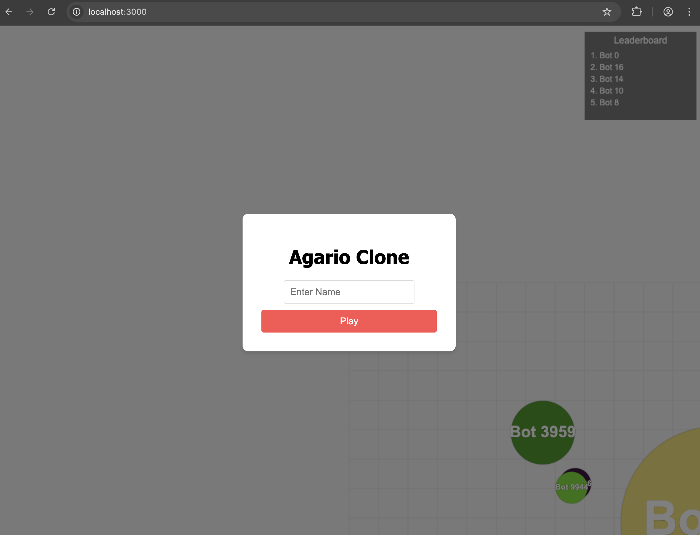

# Agario Clone

A real-time multiplayer implementation of the classic Agario game, built with Node.js, Express, and Socket.io.



## Features
- **Multiplayer**: Play against others in real-time.
- **Bots**: AI-controlled opponents to keep the game lively.
- **Viruses**: Green spiky obstacles that smaller players can push and larger players explode on contact.
- **Controls**:
    - **Mouse**: Guide your cell.
    - **Keyboard**: Use **Arrows** or **WASD** to move.
- **Leaderboard**: Real-time ranking of the top 5 biggest players.

## Folder Structure
The project follows a standard structure:
```
/src
  /server      # Backend logic (Node.js/Express)
    index.js   # Entry point
    game.js    # Game State Manager
    ...
  /public      # Client-side assets (HTML/CSS/JS)
```

## Installation
1. Clone the repository.
2. Install dependencies:
   ```bash
   npm install
   ```

## Usage
1. Start the server:
   ```bash
   npm start
   ```
   (For development with auto-restart: `npm run dev`)
   
2. Open your browser to:
   `http://localhost:3000`

3. Enter a name and play!

## License
[Apache-2.0](LICENSE)
